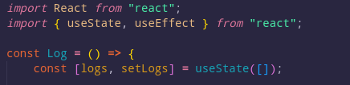

# Backend
## api.go
El código es un servidor web implementado en Go (Golang) que permite realizar operaciones aritméticas básicas (suma, resta, multiplicación y división) a través de una API y registrar dichas operaciones en una base de datos MySQL. El servidor corre en el puerto 5000 y utiliza la librería "rs/cors" para permitir solicitudes CORS.

El código comienza importando los paquetes necesarios, incluyendo "database/sql" para interactuar con la base de datos MySQL y "encoding/json" para trabajar con datos JSON.

Luego, se definen tres estructuras de datos: Operacion, Resultado y Log, que se utilizan para representar la operación a realizar, el resultado obtenido y el registro de la operación en la base de datos, respectivamente. Las estructuras Operacion y Resultado tienen campos "Num1" y "Num2" que representan los operandos de la operación, y un campo "Signo" que representa el operador a aplicar. La estructura Resultado tiene un campo "Res" que representa el resultado de la operación, mientras que la estructura Log tiene campos para el id de la operación, los operandos, el operador, el resultado, la fecha de la operación y si hubo un error.

A continuación, se define la función "conexionBD()" que se encarga de establecer la conexión con la base de datos MySQL. Esta función utiliza los valores de configuración de conexión que se encuentran en la función, tales como el usuario, contraseña, nombre de la base de datos, puerto y driver.

Luego, se define la función "ejecOperacion(op Operacion) (int, string)" que se encarga de realizar las operaciones aritméticas y devolver el resultado. Esta función recibe una estructura de tipo Operacion como parámetro y devuelve un entero y una cadena. La función utiliza la función "strconv.Atoi()" para convertir las cadenas "Num1" y "Num2" de la estructura Operacion a enteros y luego realiza la operación correspondiente (suma, resta, multiplicación o división) dependiendo del valor del campo "Signo". Si no se puede realizar la conversión de cadenas a enteros o se intenta dividir por cero, la función devuelve un mensaje de error como cadena.

La función principal "main()" comienza definiendo un enrutador HTTP con "http.NewServeMux()". Luego, se definen dos manejadores de solicitudes HTTP: "/resultado" y "/log". El manejador "/resultado" recibe una solicitud POST con una estructura Operacion como cuerpo y utiliza la función "ejecOperacion()" para realizar la operación aritmética correspondiente. Luego, se registra la operación en la base de datos utilizando la función "conexionBD()" para obtener la conexión y se inserta un nuevo registro en la tabla "operaciones" con los campos correspondientes. Finalmente, se devuelve el resultado de la operación en una estructura Resultado como respuesta JSON.

El manejador "/log" recibe una solicitud GET y utiliza la función "conexionBD()" para obtener la conexión y ejecuta una consulta para obtener todos los registros de la tabla "operaciones". Luego, se lee cada registro y se crea una estructura Log para cada uno. Todas las estructuras Log se agregan a un arreglo y se devuelve el arreglo como respuesta JSON.

Finalmente, se utiliza la función "http.ListenAndServe()" para correr el servidor en el puerto 5000. También se utiliza la librería cors para que tenga los permisos requeridos y se pueda comunicar con el frontend.

## Dockerfile

Primero se especifica que la imagen base a utilizar es golang:1.16-alpine, lo que significa que se está utilizando una imagen Alpine Linux con Golang instalado en su versión 1.16.

Luego se establece el directorio de trabajo dentro del contenedor como /app. Si el directorio no existe, Docker lo creará automáticamente.

Las siguientes 2 líneas copian los archivos go.mod y go.sum al directorio `/app` dentro del contenedor. Estos archivos son utilizados por go mod download para instalar las dependencias.

El comando siguiente ejecuta go mod download para descargar e instalar las dependencias especificadas en los archivos `go.mod` y `go.sum`.

Luego copia todos los archivos con extensión `.go` al directorio `/app` dentro del contenedor. Esto incluirá el código fuente del proyecto.

La línea siguiente ejecuta el comando `go build` para compilar el código fuente en un binario ejecutable llamado `docker-gs-ping`. El binario se guarda en el directorio raíz del contenedor (`/`).

Luego se expone el puerto 5000 en el contenedor. Sin embargo, esto no significa que el puerto esté accesible desde el exterior. Para hacerlo, deberás utilizar la opción -p o -P cuando ejecutes el contenedor.

Por último se especifica el comando que se ejecutará por defecto cuando el contenedor se inicie. En este caso, se ejecutará el binario `docker-gs-ping` que fue creado en el paso anterior.

# Frontend
## React App
La aplicación consta de 2 componentes llamados Calc.js y Log.js respectivamente, el primero contendrá la calculadora y el segundo contendrá una tabla con los registros de las operaciones realizadas. A continuación se detallan los componentes.

### calc.js
Importa las librerías necesarias para el componente: React para la creación de componentes, useState para manejar el estado del componente y useNavigate de react-router-dom para navegar a otras páginas.

Declara dos variables: `outPut` que representa la salida de la calculadora, y `operacion` que es un objeto que almacena los números y signos para la operación a realizar.

La función `escribirNum` se encarga de escribir los números en la salida. Si no se ha ingresado ningún signo previamente, se establece el número ingresado como el primer número de la operación. Si hay un signo, el número ingresado se agrega al segundo número. Luego se actualiza la salida y los valores de la operación.

La función `escribirSig` se encarga de escribir los signos en la salida y actualizar la variable `operacion`.

La función `resultado` realiza una llamada POST a una URL que espera recibir la información necesaria para realizar la operación y obtener el resultado. Al recibir el resultado, se actualiza la salida y se reinician los valores de la operación.

### log.js
Este componente de React se llama "Log". Utiliza el hook de estado "useState" y el hook de efecto "useEffect", ambos importados de la librería React. El hook de estado es utilizado para mantener una lista de registros de operaciones, y el hook de efecto es utilizado para hacer una petición GET a una API en el servidor y actualizar la lista de registros de operaciones.

El componente muestra una tabla de registros de operaciones, que contiene información sobre el número 1, número 2, operación realizada, resultado, si hubo un error, y la fecha y hora en que se realizó la operación. La tabla se construye mediante el uso de JSX.

La función "useEffect" se ejecuta solamente una vez, cuando el componente es montado en el DOM, gracias al arreglo vacío pasado como segundo argumento. La función "getLogs" hace una petición GET a la URL "http://localhost:5000/log" utilizando el método "fetch" de JavaScript, y establece el estado de la lista de registros de operaciones usando la función "setLogs". Si ocurre un error, se muestra un mensaje de error en la consola.

La función "return" retorna el JSX que representa la tabla de registros de operaciones. La lista de registros de operaciones es mapeada a una lista de elementos de la tabla mediante la función "map" de JavaScript, y se utiliza el índice de cada elemento para establecer la columna "No." en la tabla. Cada registro de operación se muestra en una fila de la tabla, con cada atributo del registro mostrado en una columna correspondiente.

## Dockerfile
Este es un archivo Dockerfile que se usa para construir una imagen de Docker que ejecutará una aplicación de Node.js. 

La línea `FROM` indica la imagen base que se usará para construir la imagen. En este caso, se está utilizando la imagen oficial de Node.js versión 18.

La línea `WORKDIR` establece el directorio de trabajo de la imagen. Esto se utiliza para especificar la ubicación del directorio en el contenedor en el que se ejecutará la aplicación.

Las líneas `COPY` se utilizan para copiar archivos en la imagen de Docker. En este caso, se están copiando los archivos `package.json` y `package-lock.json` al directorio de trabajo.

La línea `RUN` se utiliza para ejecutar comandos en la imagen durante el proceso de construcción. En este caso, se está ejecutando el comando npm install para instalar las dependencias del proyecto.

La línea `COPY . .` se utiliza para copiar los archivos del proyecto en la imagen de Docker.

La línea `EXPOSE` se utiliza para especificar el puerto en el que se ejecutará la aplicación. En este caso, se está exponiendo el puerto 3000.

La línea `CMD` se utiliza para especificar el comando que se ejecutará cuando se inicie el contenedor. En este caso, se está ejecutando el comando `npm start` para iniciar la aplicación.

# Script
## reportes.sh
El siguiente script realiza varios reportes, que a continuación se describe:

1. Crea un archivo llamado reportes.json en el directorio /tmp utilizando el comando `touch`.

2. Realiza una petición a la URL "http://backend:5000/log" y guarda la respuesta en el archivo /tmp/reportes.json utilizando el comando `curl`.

3. Imprime la cantidad total de registros en el archivo reportes.json utilizando el comando `cat` y la herramienta `jq`.

4. Imprime la cantidad de operaciones con errores en el archivo reportes.json utilizando el comando `cat` y la herramienta `jq`. Primero selecciona la propiedad "esError" de todos los elementos y luego cuenta el número de veces que se repiten cada valor utilizando los comandos `sort` y `uniq`.

5. Imprime la cantidad de operaciones en el archivo reportes.json utilizando el comando `cat` y la herramienta `jq`. Primero selecciona la propiedad "operacion" de todos los elementos y luego cuenta el número de veces que se repiten cada valor utilizando los comandos `sort` y `uniq`.

6. Imprime la cantidad de elementos con la fecha actual utilizando el comando `jq`. Primero selecciona todos los elementos que tienen una propiedad "fecha" que comienza con la fecha actual, luego cuenta la cantidad de elementos resultantes utilizando el comando `length`.

7. Imprime todos los elementos del archivo reportes.json que tienen la fecha actual utilizando el comando `jq` y un bucle while.

El script utiliza algunas herramientas como `jq` y date para procesar y manipular los datos en el archivo reportes.json.

## Dockerfile
Este es un Dockerfile para crear una imagen de Docker que ejecuta un script Bash llamado `reportes.sh`.

La imagen base utilizada es `ubuntu:20.04`. Luego, el Dockerfile instala las herramientas `jq` y `curl` utilizando los comandos `apt-get update` y `apt-get install`.

Después de eso, crea un directorio de trabajo llamado `/app` y copia el archivo `reportes.sh` dentro de este directorio.

Luego, el Dockerfile establece permisos de ejecución para el script con el comando `RUN chmod 750 reportes.sh`.

Finalmente, el script se ejecuta automáticamente cuando se inicia un contenedor basado en esta imagen de Docker, utilizando el comando `CMD ["./reportes.sh"]`.

# Docker Compose
Este archivo de Docker Compose define tres servicios: un servicio de base de datos (db), un servicio de backend y un servicio de frontend. También hay un cuarto servicio llamado "script" que se encargará de realizar los reportes desde una terminal bash.

El servicio de base de datos usa la imagen oficial de MySQL, y se define con un nombre de contenedor y se reinicia siempre. Las variables de entorno se configuran para establecer la contraseña de root, la contraseña de la base de datos y el nombre de la base de datos. Los puertos se exponen y se mapean al host, y se crea un volumen para almacenar los datos de la base de datos.

El servicio de backend se define con un nombre de contenedor, se reinicia siempre y se crea a partir de un Dockerfile en el directorio ./backend/. El servicio se expone en el puerto 5000 y depende del servicio de base de datos. También se define un enlace con el servicio de base de datos. El servicio de backend se construirá a partir del Dockerfile en el directorio ./backend/.

El servicio de frontend es similar al servicio de backend, pero se define en el puerto 3000 y depende del servicio de backend. También se define un enlace con el servicio de backend.

El servicio de script se define con un nombre de contenedor, se reinicia siempre y se crea a partir de un Dockerfile en el directorio ./script/. El servicio se expone en el puerto 3030 y depende del servicio de backend. También se define un enlace con el servicio de backend.

Por último, se crea un volumen llamado "db_data" para almacenar los datos de la base de datos.

