# MÓDULOS
## MÓDULO RAM
Este es un módulo de kernel para el sistema operativo Linux que proporciona información sobre la memoria RAM del sistema a través del sistema de archivos /proc.

En la sección de encabezados, el módulo incluye los archivos de encabezado necesarios para interactuar con el sistema operativo y proporcionar información sobre la memoria del sistema. Luego, el módulo se define con la licencia GPL y se proporciona una descripción y el nombre del autor.

La función escribir_archivo() es la encargada de proporcionar la información de la memoria RAM en el archivo /proc/ram_202000166. Esta función utiliza la función si_meminfo() para obtener información sobre la memoria del sistema y la escribe en un objeto seq_file usando la función seq_printf(). En este caso, el objeto seq_file se utiliza para proporcionar un formato de salida más fácil de leer.

La función al_abrir() se ejecuta cuando se accede al archivo /proc/ram_202000166, y llama a la función single_open() para abrir el archivo y llamar a escribir_archivo() para escribir la información de la memoria en el archivo. Esta función se utiliza junto con la estructura proc_ops que especifica las operaciones de lectura y apertura para el archivo /proc/ram_202000166.

Las funciones _insert() y _remove() se utilizan para agregar y eliminar la entrada del archivo /proc/ram_202000166. Cuando el módulo se carga, se llama a la función module_init(_insert) para agregar la entrada del archivo y se llama a la función module_exit(_remove) cuando el módulo se descarga para eliminar la entrada del archivo.

En resumen, este módulo permite al usuario obtener información sobre la memoria RAM del sistema a través del archivo /proc/ram_202000166. Cuando se accede a este archivo, el módulo proporciona información sobre la cantidad total de RAM en el sistema y la cantidad de RAM disponible.

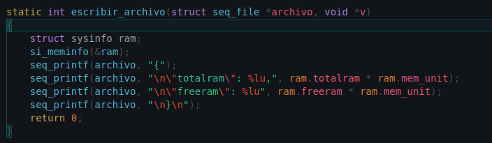

## MÓDULO CPU
Este es un módulo de kernel para Linux que escribe información sobre los procesos en un archivo virtual /proc. El archivo virtual se puede leer como un archivo regular y la información se presenta en formato JSON.

El módulo usa varias cabeceras de kernel y macros, como MODULE_LICENSE, MODULE_DESCRIPTION y MODULE_AUTHOR, que definen información sobre el módulo, como su licencia, descripción y autor.

La función principal en este módulo es escribir_archivo, que escribe información sobre los procesos en el archivo virtual /proc. La información que se escribe incluye la información del proceso, como su ID de proceso, nombre, usuario y estado, así como información sobre la memoria utilizada por el proceso y la cantidad total de tiempo de CPU utilizado por todos los procesos.

El módulo también usa varias estructuras de datos del kernel, como task_struct y mm_struct, para acceder a la información del proceso y la memoria. También usa varias funciones del kernel, como current, task_pid, get_task_cred, get_mm_rss y seq_printf, para acceder y escribir información en el archivo virtual /proc.

En general, este módulo es una práctica de programación para sistemas operativos que permite a los estudiantes familiarizarse con la programación de kernel para Linux.

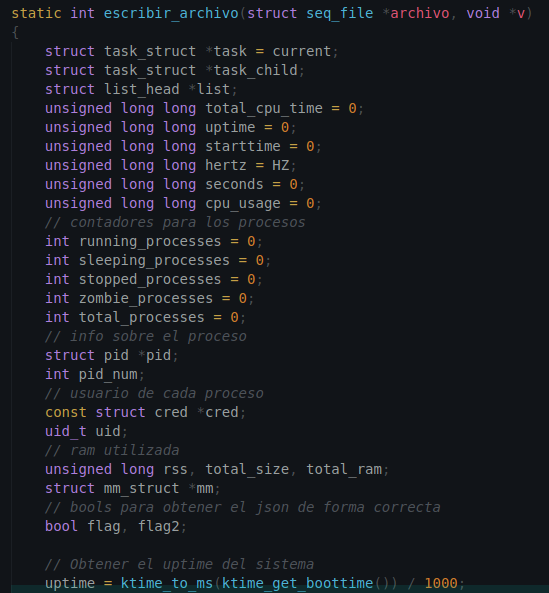

# BACKEND
## api.go
Este código de Go tiene como objetivo obtener información del uso de la CPU y la memoria RAM de un sistema operativo Linux y almacenarla en una base de datos Cloud SQL.

La información se obtiene mediante la ejecución de dos comandos de shell que devuelven la información en formato JSON. Luego, se parsea esta información y se almacena en una estructura definida en el código. Finalmente, se inserta la información en una base de datos Cloud SQL utilizando el driver correspondiente.

El código consta de las siguientes partes:

1. Definición de estructuras de datos: RAM, SubProceso, Proceso, CPU. Cada estructura representa un conjunto de datos que se obtienen del sistema o que se almacenarán en la base de datos.

2. Función de conexión a la base de datos: se utiliza el driver para establecer una conexión con la base de datos Cloud SQL. La función devuelve un objeto de conexión a la base de datos.

3. Función para borrar los registros de la base de datos: esta función se encarga de eliminar todos los registros de las tablas "proceso" y "subproceso". Si el identificador de CPU es igual a 11, también se eliminan los registros de las tablas "cpu" y "ram". Luego, se devuelve el identificador de CPU incrementado en 

4. Función main: esta es la función principal del programa. En un bucle infinito, se ejecutan los comandos de shell para obtener información de la CPU y la RAM, se parsea la información obtenida y se inserta en la base de datos Cloud SQL utilizando la conexión establecida previamente y las funciones para borrar registros e insertar registros.

Cada vez que se ejecuta la función principal, se borran todos los registros de las tablas "proceso" y "subproceso" y se insertan nuevos registros en las tablas "cpu", "ram" y "proceso". También se incrementa el identificador de CPU en 1. El bucle infinito se ejecuta continuamente, por lo que el programa siempre está recopilando y almacenando información sobre el uso de la CPU y la RAM del sistema operativo.

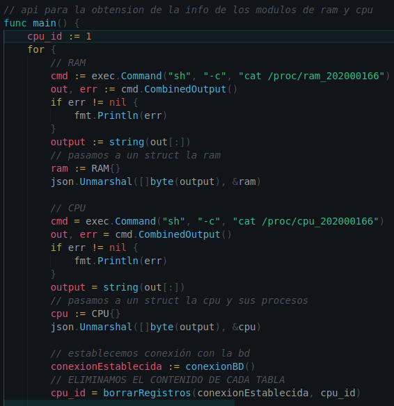

## Dockerfile
Este Dockerfile está destinado a construir una imagen de contenedor que contenga una aplicación Go. La imagen utiliza la versión 1.16 de la imagen base de Go en Alpine Linux. A continuación, se documentan cada una de las instrucciones utilizadas en este Dockerfile:

1. FROM golang:1.16-alpine especifica la imagen base de Docker que se utilizará para construir esta imagen. En este caso, se utiliza la imagen oficial de Golang versión 1.16 en Alpine Linux.

2. WORKDIR /app establece el directorio de trabajo dentro del contenedor como /app. Esto significa que todas las instrucciones que sigan se ejecutarán dentro de este directorio.

3. COPY go.mod ./ copia el archivo go.mod del directorio de construcción actual (el directorio donde se encuentra el Dockerfile) al directorio de trabajo /app del contenedor.

4. COPY go.sum ./ copia el archivo go.sum del directorio de construcción actual al directorio de trabajo /app del contenedor.

5. RUN go mod download descarga y guarda todas las dependencias especificadas en el archivo go.mod.

6. COPY *.go ./ copia todos los archivos con extensión .go del directorio de construcción actual al directorio de trabajo /app del contenedor.

7. RUN go build -o /docker-gs-ping compila el código Go en un archivo ejecutable llamado docker-gs-ping y lo guarda en el directorio raíz / del contenedor.

8. EXPOSE 4000 expone el puerto 4000 del contenedor para que otros contenedores puedan conectarse a este contenedor a través de este puerto.

9. CMD ["/docker-gs-ping"] especifica el comando que se ejecutará cuando el contenedor se inicie. En este caso, se ejecutará el archivo ejecutable docker-gs-ping que se creó en el paso 7.

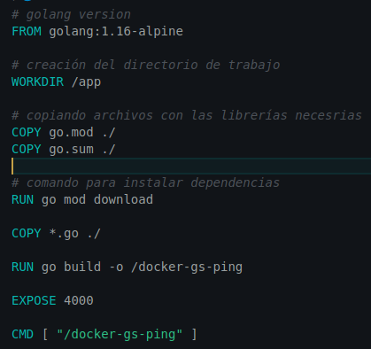

# API
## index.js
Este código es un servidor web en Node.js utilizando el framework Express para crear las rutas y manejar las solicitudes HTTP. Además, se utiliza una biblioteca para conectarse a una base de datos Cloud SQL.

* Importamos las dependencias de Express, CORS y la librería para Cloud SQL

* Creamos una instancia de Express llamada app y establecemos el puerto en 5000.

* Usamos la función use de Express para agregar middleware de CORS a nuestra aplicación.

* Creamos una conexión a la base de datos Cloud SQL utilizando la función createPool.

* Especificamos las credenciales de conexión (host, usuario, contraseña y nombre de la base de datos).

* Creamos una ruta en nuestra aplicación llamada /get-info que se encarga de obtener información de la base de datos.
Usamos la función get de 

* Express para definir la ruta.
Usamos la palabra clave async para indicar que la función es asíncrona.

* Realizamos cuatro consultas SQL a diferentes tablas de la base de datos utilizando pool.query.

* Usamos Promise.all para ejecutar las consultas de forma simultánea y almacenar los resultados en las variables ram, cpu, procesos y subprocesos.

* Enviamos los resultados en un objeto JSON utilizando res.send.
Usamos la función format de Express para especificar que la respuesta debe ser en formato JSON.

* Si hay un error, enviamos un mensaje de error y establecemos un estado de respuesta de 500.

* Iniciamos el servidor web llamando a la función listen de Express y especificando el puerto en el que queremos que se ejecute el servidor.

* Cuando el servidor se inicia, muestra un mensaje en la consola con el número de puerto utilizado.

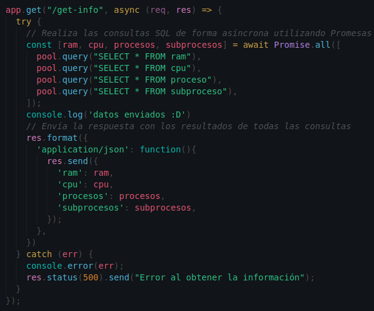

## Dockerfile

Este es un Dockerfile que se utiliza para crear una imagen de Docker para una aplicación Node.js. A continuación se detallan los pasos que realiza el archivo:

* FROM node:18: Este comando establece la imagen base que se utilizará como base para la nueva imagen de Docker. En este caso, se utiliza la imagen de Node.js versión 18.

* WORKDIR /app: Establece el directorio de trabajo para la aplicación en la imagen de Docker.

* COPY package.json ./ y COPY package-lock.json ./: Copia los archivos package.json y package-lock.json al directorio de trabajo de la aplicación en la imagen de Docker.

* RUN npm install: Ejecuta el comando npm install para instalar las dependencias de la aplicación en la imagen de Docker.

* COPY . .: Copia todos los archivos de la aplicación al directorio de trabajo de la imagen de Docker.

* EXPOSE 5000: Indica que el contenedor expone el puerto 5000.

* CMD [ "node", "index.js" ]: Define el comando que se ejecutará cuando el contenedor se inicie. En este caso, se ejecuta el archivo index.js con Node.js.

Por último, para construir la imagen de Docker, se utiliza el comando docker build en el mismo directorio donde se encuentra el Dockerfile. La imagen resultante se etiqueta con el nombre gerson7w7/api_practica2_202000166.

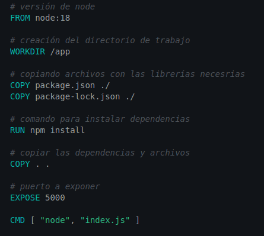

# FRONTEND
## React App
### Grafica.js
Este componente de React es una clase que renderiza una gráfica de área utilizando la librería "recharts". Toma como entrada un conjunto de datos en forma de objeto con pares de valores de "name" y "uv".

El componente "AreaChart" de "recharts" es utilizado para renderizar la gráfica, el cual es configurado a través de sus propiedades. "CartesianGrid" es un subcomponente utilizado para definir una cuadrícula de fondo en la gráfica. "XAxis" y "YAxis" definen los ejes x e y respectivamente, y "Tooltip" es una herramienta que muestra información detallada cuando el usuario hace hover sobre la gráfica.

El conjunto de datos es pasado a través de la prop "data", la cual es obtenida desde las props del componente. El ancho y alto de la gráfica son definidos a través de las propiedades "width" y "height". El margen del componente es configurado a través de la propiedad "margin".

La línea de área en la gráfica es definida a través del componente "Area". La propiedad "dataKey" especifica la clave del conjunto de datos utilizado para la línea de área, mientras que "stroke" y "fill" definen el color de la línea de área.

En resumen, este componente renderiza una gráfica de área utilizando la librería "recharts", tomando como entrada un conjunto de datos en forma de objeto con pares de valores de "name" y "uv".

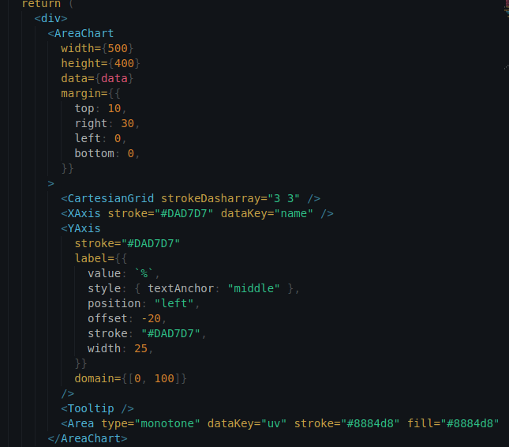

### Stats.js
Este es un componente de React llamado Stats que muestra información sobre el rendimiento del sistema en forma de gráficas y tablas. Utiliza los hooks useState y useEffect para gestionar el estado de los datos y actualizarlos en intervalos regulares.

Cuando el componente se monta, se ejecuta la función fetchData() que hace una petición GET a la URL http://localhost:5000/get-info para obtener los datos del rendimiento del sistema. Luego de recibir los datos, se transforman y almacenan en los estados correspondientes utilizando los métodos setRamS, setCpuS, setProcesosS y setEstadoS.

Después de obtener los datos, se renderizan dos componentes Grafica con los datos de la RAM y el CPU, respectivamente. También se muestra una tabla con información sobre el estado actual del sistema.

El componente Stats también utiliza el hook useEffect para gestionar el intervalo en el que se actualizan los datos utilizando un setInterval. El intervalo se establece en 5 segundos y se cancela cuando el componente se desmonta utilizando el método clearInterval en el return de useEffect.

En resumen, el componente Stats muestra información en tiempo real sobre el rendimiento del sistema en forma de gráficas y tablas, actualizándose cada 5 segundos.

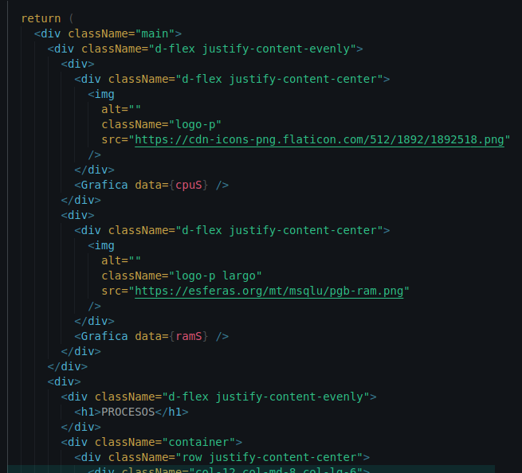

### Dashboard.js
Este es un componente de React que renderiza un dashboard básico con una imagen de logo y un título "DASHBOARD", seguido de un componente Stats. Aquí hay una descripción de las diferentes partes del componente:

1. El componente React se importa desde la biblioteca "react".

2. El componente Stats se importa desde "./Stats".

3. El componente Dashboard es una función de flecha sin parámetros, que devuelve un JSX. JSX es una sintaxis similar a HTML que se utiliza en React para definir los elementos de la interfaz de usuario.

4. El código JSX define un div con la clase "main" y varios elementos HTML, incluyendo una imagen con la clase "logo", un título h1 con el texto "DASHBOARD", y un componente Stats.

5. Finalmente, se exporta el componente Dashboard para que pueda ser utilizado en otros archivos de la aplicación.

En resumen, este componente de React define una página de dashboard básica que utiliza el componente Stats para mostrar estadísticas o información adicional.

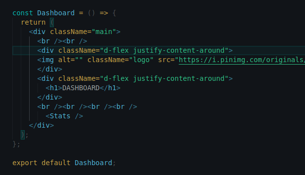

## Dockerfile
Este Dockerfile es un archivo de configuración utilizado para construir una imagen de Docker para una aplicación Node.js. Aquí hay una descripción de cada línea:

* FROM node:18: establece la imagen base de la cual se construirá esta imagen. En este caso, la imagen base es node:18.

* WORKDIR /app: establece el directorio de trabajo en el contenedor Docker como /app.

* COPY package.json ./ y COPY package-lock.json ./: copia el archivo package.json y package-lock.json del directorio actual a /app en el contenedor Docker.

* RUN npm install: ejecuta el comando npm install en el contenedor Docker para instalar las dependencias especificadas en package.json.

* COPY . .: copia todos los archivos del directorio actual al directorio /app en el contenedor Docker.

* EXPOSE 3000: indica que el contenedor Docker escuchará en el puerto 3000.

* CMD [ "npm", "start" ]: especifica el comando predeterminado que se ejecutará cuando se inicie el contenedor Docker. En este caso, se ejecutará npm start para iniciar la aplicación.

En general, este Dockerfile se utiliza para construir una imagen de Docker para una aplicación Node.js, en la que se copian los archivos y se instalan las dependencias antes de iniciar la aplicación. El puerto 3000 se expone para permitir que la aplicación se acceda desde fuera del contenedor Docker.

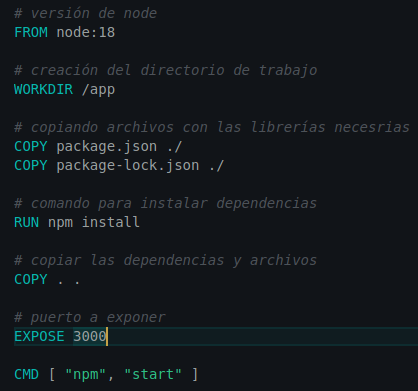

# CLOUD SQL
Utilizamos cloudSQL para crear la base de datos que se utilizará para guardar las tablas con la información de cada uno de los procesos, así como la información de la RAM y CPU. 

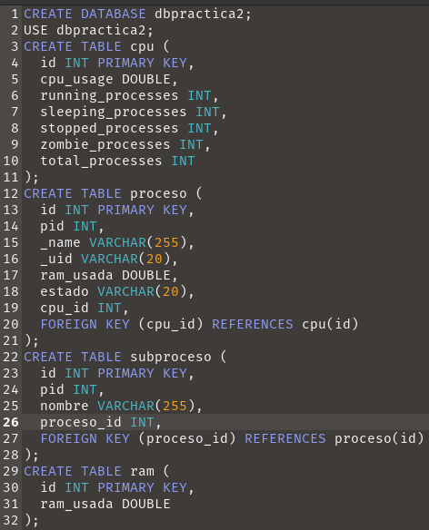