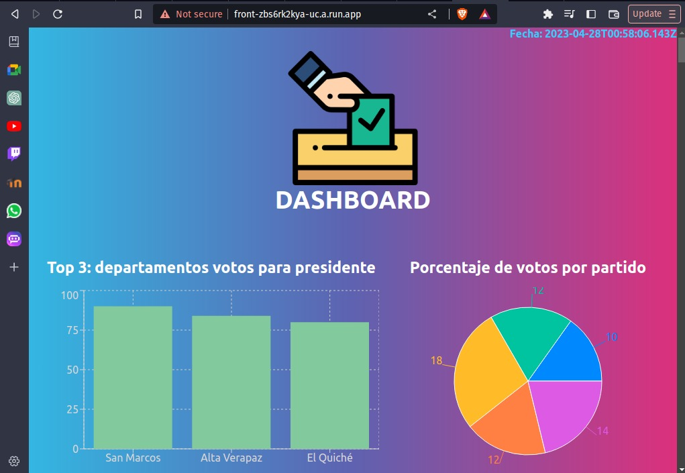
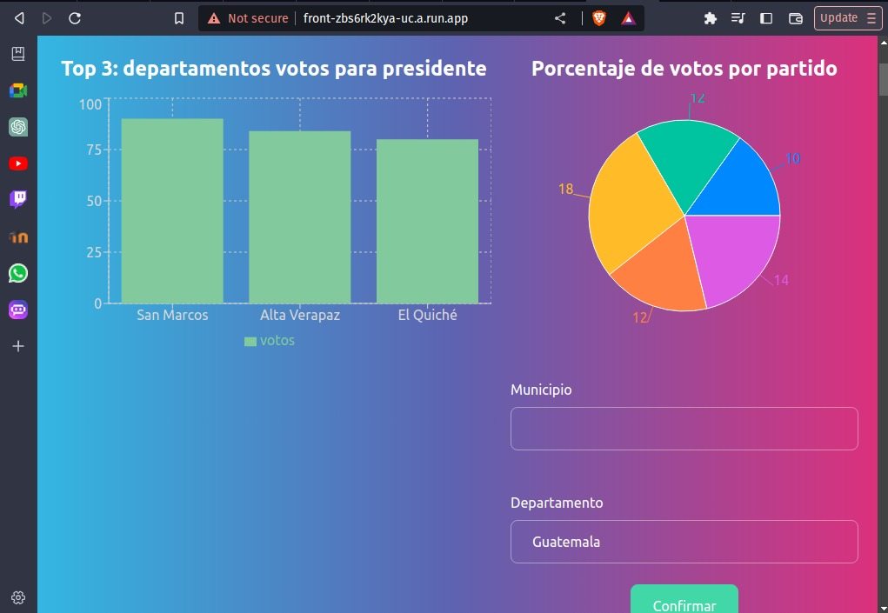
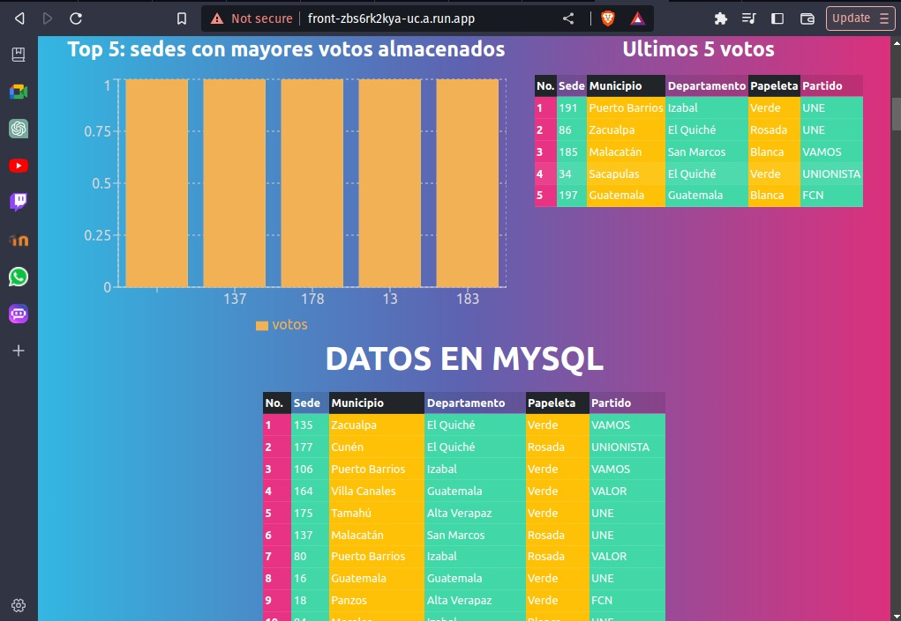
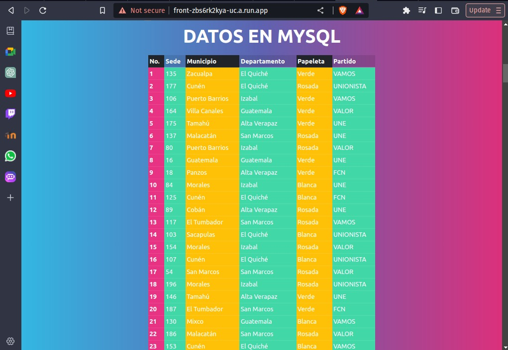

# UTILIZACIÓN DE LA APLICACIÓN

Al acceder a la aplicación web se muestra un dashboard de información en tiempo real.
Este contiene datos relevantes respecto al conteo de votos para llevar un control de cómo las elecciones cambian en cada instante.

  
La primer información que muestra el dashboard es:
- La hora actual
- Una gráfica de los 3 departamentos con mayores votos para presidente
- Un gráfico circular del porcentaje de votos por partido el cual es posible filtrar por municipio y departamento

Esta información se obteien tal como se muestra a continuación:

  

Luego se muestra
- Una gráfica de las 5 sedes con mayor cantidad de votos almacenados.
- Una tabla que muestra los últimos 5 votos que han sido almacenados en la base de datos Redis.

Estos elementos se ven de la siguiente forma:

  

Para finalizar el dashboard, se muestra una tabla con todos los votos almacenados en la base de datos MYSQL. Estos datos corresponden a todos los votos que han sido realizados.

