# LOCUST
Este código es una implementación de un escenario de pruebas de carga (load testing) utilizando la herramienta Locust.

La clase ReadFile es una clase auxiliar que se encarga de leer un archivo JSON llamado "traffic.json" y almacenar sus datos en una lista. El método getData devuelve un elemento aleatorio de la lista y lo elimina de la misma. Si la lista está vacía, devuelve None. El método loadFile es el que se encarga de abrir el archivo y cargar los datos en la lista de la clase.

La clase CargaTrafico es la que representa al usuario que realizará la carga. Es una subclase de HttpUser, lo que significa que es capaz de realizar peticiones HTTP. El atributo wait_time establece el tiempo de espera entre peticiones, que se encuentra en el rango de 0.1 a 0.9 segundos. El atributo reader es una instancia de la clase ReadFile, que se utiliza para obtener los datos que se enviarán en cada petición.

El método on_start se ejecuta al inicio de la prueba y simplemente imprime un mensaje. El decorador @task indica que el método sendData será la tarea que se realizará en cada petición. En este método se obtiene un elemento de la lista de datos utilizando el método getData de la instancia de ReadFile. Si se obtiene un elemento, se realiza una petición HTTP POST a la ruta "/add-voto" utilizando los datos obtenidos. El resultado de la petición se imprime por pantalla. Si no se obtiene ningún elemento, se imprime un mensaje indicando que la lista está vacía y se detiene la prueba mediante el método stop con un parámetro de True.

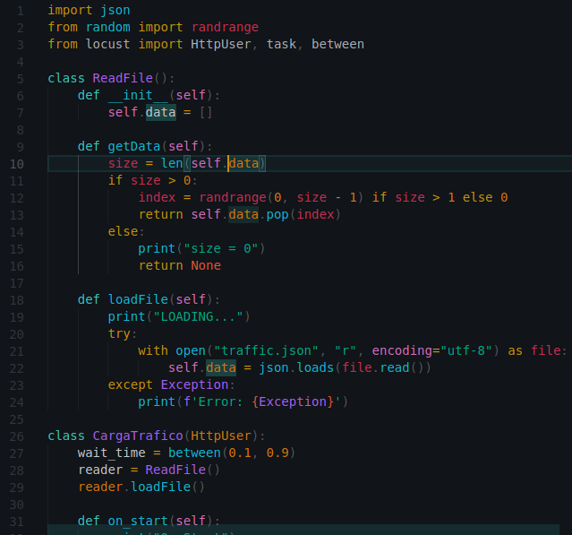

# RUTA 1
## PROTO
Este archivo es un archivo de definición de protocolo (Protocol Buffer) en su versión 3. El archivo define un servicio llamado "Votos" que tiene un método llamado "AddVoto" que recibe un objeto de tipo "VotoRequest" y devuelve un objeto de tipo "Reply".

El objeto "VotoRequest" es un mensaje que tiene 5 campos: "sede", "municipio", "departamento", "papeleta" y "partido". Todos los campos son de tipo string excepto "sede" que es de tipo entero de 32 bits. Este mensaje se utiliza como el objeto que se envía en la petición al método "AddVoto".

El objeto "Reply" es un mensaje que tiene un único campo llamado "message" que es de tipo string. Este mensaje se utiliza como el objeto que se recibe en la respuesta del método "AddVoto".

Los bloques de opciones en el archivo proporcionan información adicional para la generación de código en lenguajes específicos. Por ejemplo, la opción java_package establece el paquete Java en el que se generará el código. La opción objc_class_prefix establece un prefijo para las clases generadas en Objective-C. La opción java_outer_classname establece el nombre de la clase Java que contiene el servicio y los mensajes definidos en el archivo. La opción java_multiple_files indica que se generarán múltiples archivos de Java para el servicio y los mensajes en lugar de uno solo.
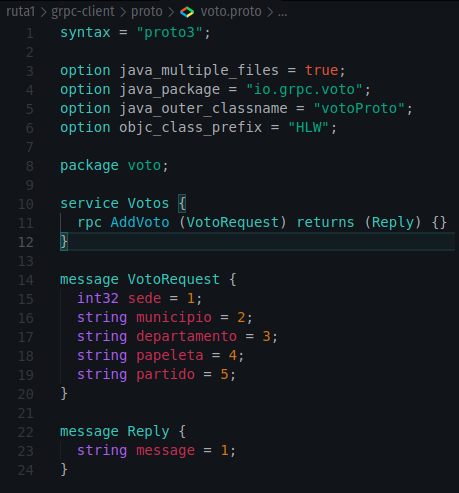

## gRPC CLIENT
### client.js
Este código es un cliente gRPC en JavaScript que se comunica con un servidor gRPC utilizando el protocolo definido en el archivo "voto.proto". El cliente utiliza el módulo npm "grpc-js" para generar el cliente gRPC.

La primera parte del código carga el archivo "voto.proto" utilizando el módulo "proto-loader". Luego, se utiliza la función "grpc.loadPackageDefinition" para cargar el archivo en la variable "voto_proto".

Después, se utiliza el módulo "minimist" para analizar los argumentos de línea de comando y se define la dirección del servidor gRPC. La variable "client" se inicializa utilizando la dirección del servidor y las credenciales de conexión.

La segunda parte del código es un servidor HTTP Express que proporciona una API REST para interactuar con el servidor gRPC. La API tiene una ruta "GET /" que devuelve "Server Status: OK" y una ruta "POST /add-voto" que recibe una solicitud JSON con los campos "sede", "municipio", "departamento", "papeleta" y "partido". La solicitud se convierte en un objeto "data_voto" que se utiliza como argumento en la llamada al método "AddVoto" del cliente gRPC. La respuesta del método se envía como una respuesta JSON con el campo "message".

En resumen, este cliente gRPC utiliza un servidor HTTP Express para proporcionar una API REST que interactúa con el servidor gRPC.

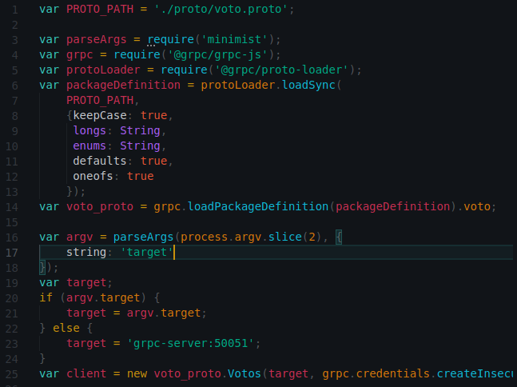

### Dockerfile
Este es un archivo Dockerfile que se utiliza para crear una imagen de Docker. La imagen se basa en la imagen de Alpine de Node.js y utiliza npm para instalar las dependencias necesarias para ejecutar el cliente gRPC.

El archivo comienza con la instrucción "FROM node:alpine", que indica que la imagen se basará en la versión alpina de Node.js.

Luego, se establece el directorio de trabajo utilizando la instrucción "WORKDIR /app".

La siguiente instrucción "COPY" copia los archivos "package.json" y "package-lock.json" desde la ubicación local a la imagen.

La siguiente instrucción "RUN" utiliza npm para instalar las dependencias necesarias en la imagen.

La siguiente instrucción "COPY" copia el directorio "proto" y el archivo "client.js" desde la ubicación local a la imagen.

La instrucción "EXPOSE" expone el puerto 4000 para que se pueda acceder al servidor HTTP Express desde fuera del contenedor.

Finalmente, la instrucción "CMD" se utiliza para especificar el comando que se ejecutará cuando se inicie el contenedor. En este caso, se ejecutará el archivo "client.js" utilizando Node.js.

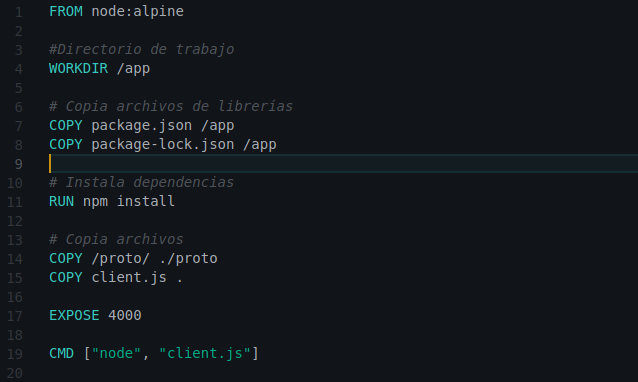

## gRPC SERVER
### conn.js
Este es un archivo de conexión a una base de datos MySQL usando el módulo mysql2 en Node.js.

Primero, se importa el módulo mysql2 usando la sentencia require. Luego se crea una conexión usando la función createConnection(), donde se proporciona la información necesaria para conectarse a la base de datos, como el host, el usuario, la contraseña, la base de datos y el puerto.

Después, se llama a la función connect() de la conexión creada para establecer una conexión con la base de datos. Si se produce un error en la conexión, se lanza una excepción; de lo contrario, se imprime en la consola un mensaje indicando que se ha establecido la conexión.

Por último, se exporta la conexión creada para que pueda ser utilizada en otros archivos de Node.js.

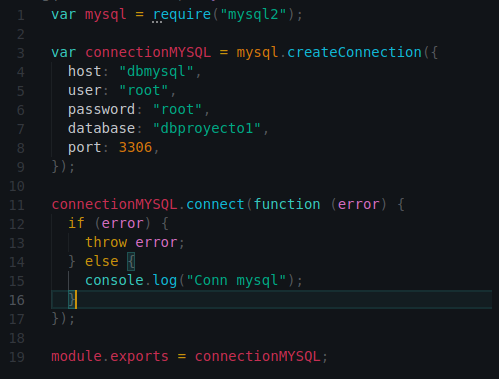

### server.js
Este código es un servidor de gRPC que implementa el servicio definido en el archivo proto voto.proto. El servidor utiliza la librería @grpc/grpc-js para implementar la comunicación en gRPC.

La función AddVoto es la que se encarga de procesar las peticiones RPC entrantes. En este caso, la función recibe una petición RPC del cliente y realiza una inserción en una base de datos MySQL utilizando los datos proporcionados en la petición.

La conexión a la base de datos se realiza a través del módulo conn, que se exporta desde otro archivo en el mismo directorio.

El servidor se inicializa en la función main(), que crea una instancia de grpc.Server y agrega el servicio definido en el archivo proto. A continuación, el servidor se enlaza al puerto 50051 y se inicia.

En resumen, este código es un servidor de gRPC que implementa un servicio para agregar votos a una base de datos MySQL.

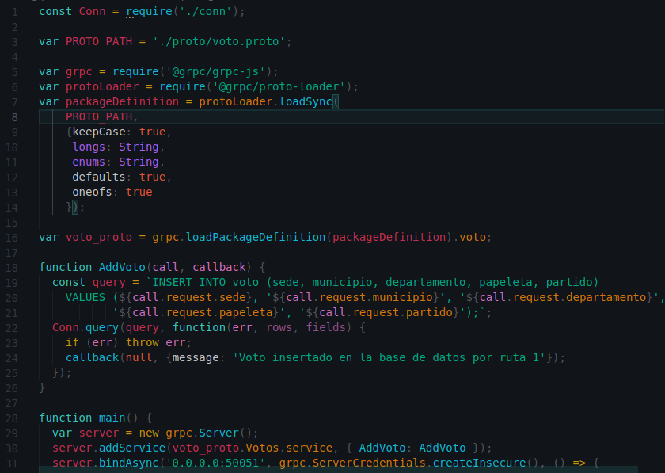

### Dockerfile
Este es un archivo Dockerfile utilizado para construir una imagen de Docker que se utilizará para ejecutar un servidor gRPC en un contenedor Docker. 

FROM node:alpine: especifica la imagen base que se utilizará para construir la imagen de Docker. En este caso, se está utilizando la versión alpina de la imagen de Node.js, que es una imagen ligera de Linux basada en Alpine Linux.

WORKDIR /app: establece el directorio de trabajo actual del contenedor como /app.

COPY package.json /app y COPY package-lock.json /app: copia los archivos package.json y package-lock.json en el directorio /app del contenedor. Estos archivos son necesarios para instalar las dependencias del servidor gRPC.

RUN npm install: ejecuta el comando npm install para instalar las dependencias necesarias para el servidor gRPC.
COPY /proto/ ./proto: copia el directorio /proto del proyecto al directorio /app/proto del contenedor.

COPY server.js .: copia el archivo server.js del proyecto al directorio /app del contenedor. Este archivo contiene la lógica del servidor gRPC.
COPY conn.js .: copia el archivo conn.js del proyecto al directorio /app del contenedor. Este archivo contiene la configuración para la conexión a la base de datos.

EXPOSE 50051: expone el puerto 50051 del contenedor para que pueda ser accesible desde el host.

CMD ["node", "server.js"]: especifica el comando que se ejecutará cuando se inicie el contenedor. En este caso, se está ejecutando el comando node server.js para iniciar el servidor gRPC.

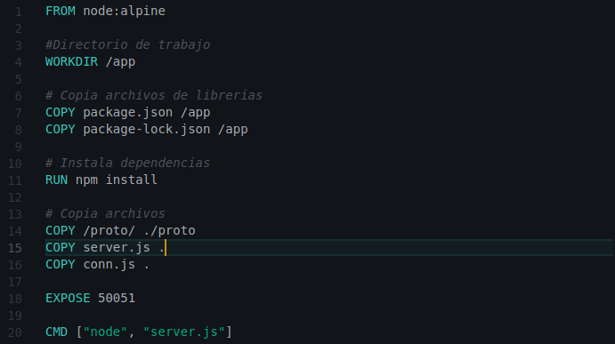

# RUTA 2
## PUB-REDIS
### main.go
Este es un programa escrito en lenguaje Go que utiliza la biblioteca go-redis para conectarse a un servidor Redis y publicar datos en un canal. A continuación, explicaré los principales aspectos del código:

1. Se importan los paquetes necesarios:

 * context es un paquete estándar de Go que se utiliza para manejar contextos de ejecución.
 * encoding/json es un paquete estándar de Go que se utiliza para codificar y decodificar datos JSON.
 * github.com/go-redis/redis/v8 es una biblioteca de Go para conectarse y operar con servidores Redis.
 * github.com/gofiber/fiber/v2 es un marco web de Go que se utiliza para implementar la API REST.

2. Se define una estructura Voto con los campos Sede, Municipio, Departamento, Papeleta y Partido.

3. Se crea un cliente Redis con la función redis.NewClient y se especifica la dirección del servidor Redis (Addr).

4. Se define la función principal (main) que crea una instancia de la aplicación web Fiber.

5. Se define un controlador para la ruta /add-voto que se activa cuando se recibe una solicitud POST. El controlador toma los datos del cuerpo de la solicitud (c.BodyParser(voto)) y los serializa en formato JSON (json.Marshal(voto)). Luego, publica los datos en el canal datos-votos utilizando la función redisClient.Publish. Después de publicar los datos, incrementa el contador de votos utilizando la función redisClient.Incr y guarda el nuevo voto en Redis utilizando la función redisClient.Set.

6. Se inicia el servidor web utilizando la función app.Listen y se especifica el puerto en el que se escucharán las solicitudes entrantes (:4100).

En resumen, este programa utiliza Redis como un intermediario para recibir y almacenar datos de votación y luego publicarlos en un canal para que otros programas puedan suscribirse y procesar los datos en tiempo real.

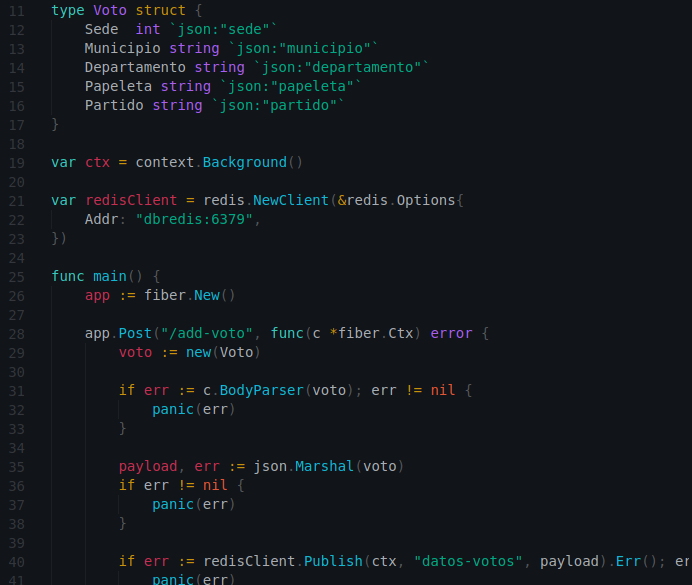

### Dockerfile
Este es un Dockerfile que define una imagen de Docker basada en la imagen golang:1.20-alpine. A continuación se detalla cada una de las instrucciones presentes en el archivo:

FROM golang:1.20-alpine: indica que se utilizará como imagen base la imagen de golang con la etiqueta 1.20-alpine.

ENV GOPROXY=https://proxy.golang.org: establece la variable de entorno GOPROXY con el valor https://proxy.golang.org.

WORKDIR /: establece el directorio de trabajo dentro del contenedor en la raíz (/).

COPY . .: copia todo el contenido del directorio actual (el directorio donde se encuentra el Dockerfile) al directorio de trabajo dentro del contenedor (la raíz).

RUN go mod download: ejecuta el comando go mod download para descargar las dependencias de Go definidas en el archivo go.mod.

EXPOSE 4100: indica que el contenedor expondrá el puerto 4100.

CMD ["go", "run", "/main.go"]: establece el comando que se ejecutará al iniciar el contenedor, que es go run /main.go, lo que compilará y ejecutará el archivo main.go de la raíz del contenedor.

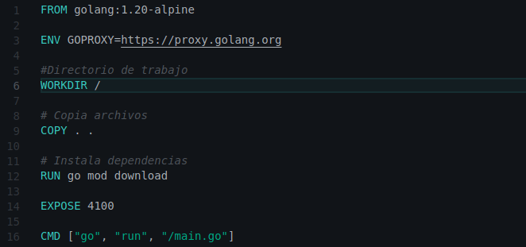

## SUB-REDIS
### main.go
Este es un programa de suscripción a Redis que escucha mensajes en el canal datos-votos y luego decodifica el mensaje en formato JSON para insertar la información en una base de datos MySQL.

Importamos las librerías que necesitamos para este programa, incluyendo go-redis para interactuar con Redis y database/sql para interactuar con MySQL. También importamos el controlador MySQL de go-sql-driver utilizando _ para que el importador no se queje por no usarlo explícitamente en nuestro código.

Definimos la estructura Voto para que podamos deserializar los mensajes de Redis en esta estructura.

Creamos un cliente Redis y especificamos la dirección y el puerto donde se está ejecutando el servidor Redis.

Creamos una suscripción Redis en el canal datos-votos utilizando el cliente Redis que creamos anteriormente. Luego entramos en un bucle infinito que escucha continuamente mensajes del canal utilizando la función ReceiveMessage(). Si se produce un error, el programa se detiene y muestra el mensaje de error.

Si el mensaje se recibe correctamente, lo decodificamos en una estructura Voto utilizando la función json.Unmarshal(). Luego llamamos a la función insertar() para insertar el voto en la base de datos MySQL. Si la inserción es exitosa, imprimimos un mensaje de confirmación en la consola.

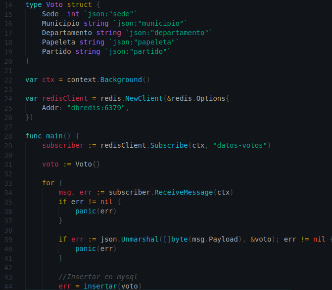

### Dockerfile
Este Dockerfile se utiliza para construir una imagen de Docker para ejecutar una aplicación Go. Aquí está lo que hace cada línea:

FROM golang:1.20-alpine: Define la imagen base que se utilizará para construir la nueva imagen. En este caso, se está utilizando la imagen oficial de Go en su versión 1.20 y basada en Alpine Linux.

ENV GOPROXY=https://proxy.golang.org: Define una variable de entorno para el proxy de Go.

WORKDIR /: Establece el directorio de trabajo dentro del contenedor en la raíz del sistema de archivos.

COPY . .: Copia todos los archivos del directorio actual en el directorio de trabajo dentro del contenedor.

RUN go mod download: Descarga todas las dependencias necesarias para la aplicación utilizando el archivo go.mod.

CMD ["go", "run", "/main.go"]: Especifica el comando que se ejecutará cuando se inicie el contenedor. En este caso, se está ejecutando el comando go run /main.go, lo que ejecuta la aplicación Go.

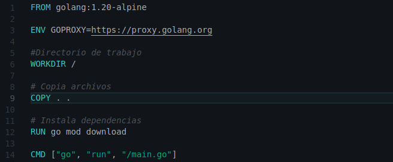

# MYSQL
## database.sql
Este archivo SQL es un script para crear una tabla llamada "voto" en la base de datos "dbproyecto1". La estructura de la tabla consta de 6 columnas:

id: columna entera que es la clave primaria de la tabla y se incrementa automáticamente con cada nueva fila.

sede: columna entera que almacena el número de la sede de votación.

municipio: columna de texto que almacena el nombre del municipio donde se encuentra la sede de votación.

departamento: columna de texto que almacena el nombre del departamento donde se encuentra la sede de votación.

papeleta: columna de texto que almacena el número o código de la papeleta de votación.

partido: columna de texto que almacena el nombre del partido político al que se emitió el voto.

La instrucción "USE dbproyecto1" se utiliza para seleccionar la base de datos "dbproyecto1" en la que se creará la tabla.

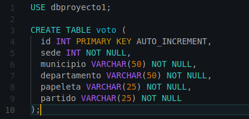

## Dockerfile
Este Dockerfile es para crear una imagen de Docker que tenga instalado MySQL y que configure algunas opciones al iniciar el contenedor.

FROM mysql:latest: se basa en la última versión de la imagen de MySQL disponible en Docker Hub. Es decir, se utiliza como imagen base.

ENV MYSQL_ROOT_PASSWORD=root: establece la contraseña de root para MySQL como "root". Esto se hace utilizando la variable de entorno MYSQL_ROOT_PASSWORD, que es utilizada por la imagen de MySQL para configurar el usuario "root".

ENV MYSQL_DATABASE=dbproyecto1: establece el nombre de la base de datos que se creará automáticamente al iniciar el contenedor.

COPY ./database.sql /docker-entrypoint-initdb.d/: copia el archivo database.sql local en la carpeta /docker-entrypoint-initdb.d/ dentro del contenedor. La imagen de MySQL utiliza esa carpeta para buscar archivos SQL y ejecutarlos automáticamente cuando se inicia el contenedor.

EXPOSE 3306: indica que el contenedor expone el puerto 3306, que es el puerto por defecto que utiliza MySQL para las conexiones. Este comando no hace que el puerto esté accesible desde fuera del contenedor, sino que simplemente indica que está disponible. Es necesario utilizar la opción -p al ejecutar el contenedor para mapear el puerto del contenedor al puerto del host.

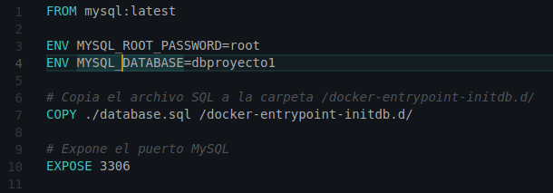

# REDIS
## redis.conf
Este archivo es la configuración de Redis, un popular sistema de base de datos en memoria utilizado para almacenar datos en caché y para almacenar datos de sesión en aplicaciones web.

1. La línea "bind 0.0.0.0" indica que Redis estará escuchando en todas las interfaces de red disponibles, lo que permite que Redis sea accesible desde cualquier lugar.
2. "protected-mode no" permite el acceso no autenticado a Redis. Es importante tener en cuenta que esto puede ser un riesgo de seguridad si Redis está expuesto a Internet.
3. "port 6379" indica que Redis estará escuchando en el puerto 6379, que es el puerto predeterminado utilizado por Redis. Si se cambia el puerto en este archivo, también se debe cambiar en las aplicaciones que usen Redis.

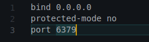

## Dockerfile
Este es un Dockerfile para construir una imagen de Docker que ejecuta un servidor Redis.

Esta línea especifica que la imagen base para construir esta imagen es la imagen oficial de Redis más reciente disponible en Docker Hub.

Esto establece el directorio de trabajo de la imagen como /usr/src/app.

Esto copia el archivo de configuración de Redis, redis.conf, del directorio local a /usr/local/etc/redis/redis.conf en la imagen.

Esto indica que el contenedor debe escuchar en el puerto 6379, el puerto por defecto de Redis, para que se pueda acceder al servidor Redis desde fuera del contenedor.

Finalmente, esto establece el comando por defecto que se ejecutará cuando el contenedor se inicie. En este caso, el comando es redis-server /usr/local/etc/redis/redis.conf, que ejecuta Redis utilizando el archivo de configuración que hemos copiado previamente.

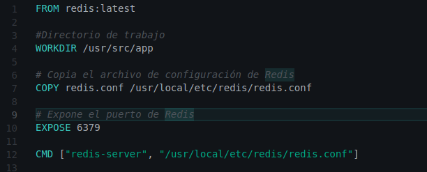

# API
## api.js
El archivo api.js es un archivo JavaScript que utiliza varias librerías para crear una API RESTful. La API se comunica con una base de datos MySQL y una base de datos Redis. A continuación, se detallan las librerías utilizadas y la funcionalidad de cada sección del código.

* express: es un framework para aplicaciones web de Node.js. Se utiliza para crear una aplicación web y definir rutas y endpoints de la API.

* cors: es un middleware que se utiliza para permitir que se realicen peticiones desde otros dominios.

* mysql2/promise: es un driver de MySQL para Node.js que se utiliza para conectarse y realizar consultas a una base de datos MySQL.

* body-parser: es un middleware que se utiliza para parsear el cuerpo de las peticiones HTTP.

* ws: es una librería que se utiliza para crear un servidor WebSocket.

* redis: es una base de datos en memoria que se utiliza para almacenar datos en caché y mejorar el rendimiento de la API.

* promisify: es una función que se utiliza para convertir una función que utiliza callbacks en una función que devuelve una promesa.

El código comienza por crear una instancia de la aplicación Express y definir el puerto en el que la API escuchará las peticiones entrantes. Luego se agregan los middlewares cors y body-parser.

La sección siguiente crea una conexión a la base de datos MySQL utilizando el paquete mysql2/promise. Se crea un pool de conexiones y se configura con las credenciales de acceso a la base de datos.

Luego se crea una instancia del cliente Redis y se define el puerto y host de la base de datos Redis. También se agregan callbacks para manejar eventos de conexión y error.

La siguiente sección define una ruta en la API utilizando el método app.post. Cuando se recibe una petición HTTP POST en esta ruta, se ejecuta una función que realiza las siguientes operaciones:

* Realiza una consulta a la base de datos MySQL para obtener una lista de votos.

* Crea un gráfico de barras que muestra los tres departamentos con más votos para presidente.

* Crea un gráfico circular que muestra el porcentaje de votos por partido según el municipio o departamento que se haya especificado en la petición.

* Realiza consultas a la base de datos Redis para obtener los datos necesarios para crear dos gráficos: un gráfico de barras que muestra las cinco sedes con más votos y un gráfico que muestra los últimos cinco votos almacenados en Redis.

* Devuelve los datos de los cuatro gráficos en la respuesta HTTP.

La última sección del código crea un servidor HTTP y un servidor WebSocket utilizando las librerías http y ws. El servidor WebSocket se utiliza para enviar actualizaciones en tiempo real a los clientes que se conecten a la API.

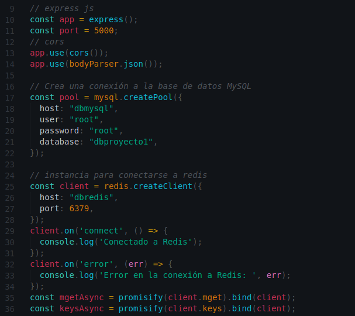

## Dockerfile
Este es un archivo Dockerfile, que se utiliza para construir una imagen de contenedor de Docker.

Define la imagen base que se utilizará para construir la imagen del contenedor. En este caso, se está utilizando la versión 18 de Node.js.

Establece el directorio de trabajo dentro del contenedor. En este caso, se está estableciendo el directorio de trabajo como /app.

Copian los archivos package.json y package-lock.json al directorio de trabajo (/app). Estos archivos son necesarios para instalar las dependencias del proyecto.

Ejecuta el comando npm install dentro del contenedor para instalar las dependencias necesarias del proyecto. Este comando lee el archivo package.json y descarga e instala las dependencias que se encuentran en él.

Copia todos los archivos del proyecto al directorio de trabajo (/app). Esto incluye los archivos de la aplicación y los archivos necesarios para configurar el contenedor.

Expone el puerto 5000 del contenedor al host. Esto significa que cualquier aplicación que se ejecute en el contenedor y que escuche en el puerto 5000, podrá ser accedida desde el host.

Establece el comando que se ejecutará cuando se inicie el contenedor. En este caso, se está ejecutando el archivo api.js usando Node.js.

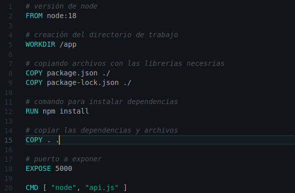

# FRONTEND
## COMPONENTS
### Dashboard.js
Este es un componente de React llamado Dashboard. En el archivo se importa React, Stats, WebSocket y useEffect y useState de React.

El componente se define como una función flecha, con el nombre Dashboard, que retorna un JSX, que es una sintaxis que combina HTML y JavaScript.

Dentro del componente, hay un estado llamado 'fecha' que se inicializa en null usando el hook useState. La constante 'ip' se define como 'localhost'.

Se utiliza el hook useEffect para establecer una conexión WebSocket con el servidor. Se crea una instancia de WebSocket que se conecta a la dirección del servidor a través de un canal de comunicación bidireccional que se mantiene abierto. En la función 'onmessage' se recibe un mensaje desde el servidor que contiene la fecha actual en formato JSON. Se extrae la fecha de este mensaje y se actualiza el estado de la fecha utilizando el método setFecha.

El componente devuelve una div con la clase "main". Dentro de esta div, hay un contenedor de texto que muestra la fecha actual. Luego hay una imagen y un encabezado que muestran el título del panel. Después de esto, se utiliza el componente Stats que se importa en la parte superior del archivo.

Finalmente, el componente se exporta como un módulo predeterminado para que pueda ser utilizado por otros componentes o módulos de la aplicación.

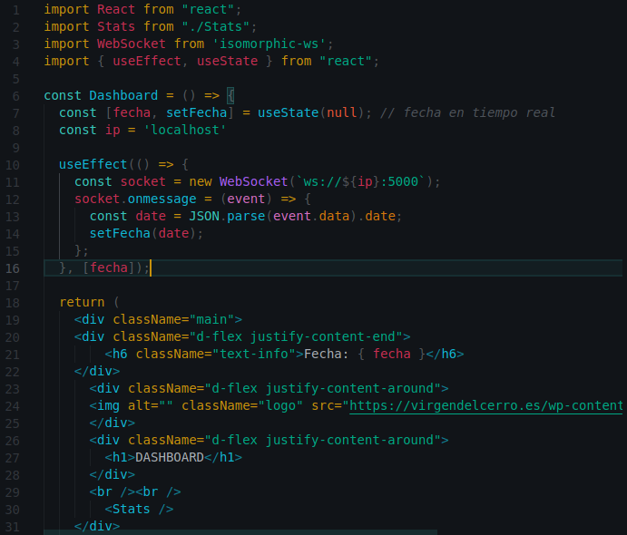

### Grafica1.js
Este componente de React utiliza la librería Recharts para crear un gráfico de barras. La clase Grafica1 extiende la clase PureComponent de React y su única función es renderizar el gráfico utilizando los datos que recibe como prop.

El gráfico de barras se construye mediante el componente BarChart de Recharts, que toma como propiedades el ancho y alto del gráfico, los datos a representar, y un objeto de márgenes. Luego, se agregan los componentes CartesianGrid, XAxis, YAxis, Tooltip, y Legend para definir el estilo y la información a mostrar en el gráfico.

Finalmente, se agrega un componente Bar que recibe como propiedades los datos a representar y el color de las barras. En este caso, se utiliza el color verde #82ca9d.

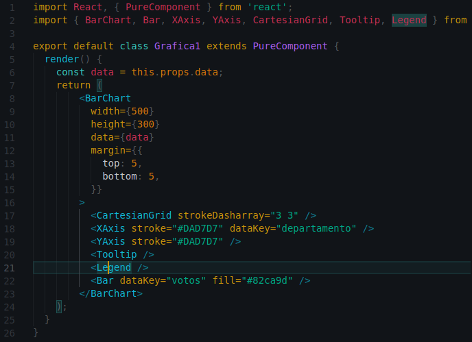

### Grafica2.js
Este es un componente de React que utiliza la librería Recharts para crear una gráfica de pastel (pie chart) con datos proporcionados mediante las props.

El componente se llama "Grafica2" y extiende de la clase PureComponent. En su método "render" se define la gráfica de pastel utilizando los componentes "PieChart", "Pie", "Cell" y "Tooltip" de Recharts.

La gráfica de pastel utiliza datos proporcionados en las props mediante el objeto "data01", el cual es un arreglo de objetos con dos propiedades: "name" y "value".

El componente "Pie" representa los datos en la gráfica de pastel y tiene las siguientes propiedades:

* "dataKey": especifica qué propiedad de los datos se utilizará para representar los valores en la gráfica.
* "isAnimationActive": establece si se activa o no la animación al dibujar la gráfica.
* "data": los datos que se representarán en la gráfica.
* "cx" y "cy": establecen la posición del centro de la gráfica en el eje X e Y, respectivamente.
* "outerRadius": establece el radio del círculo exterior de la gráfica.
* "fill": establece el color de relleno del área de cada sección de la gráfica.
* "label": establece si se muestra o no la etiqueta de cada sección.
El componente "Cell" se utiliza para asignar un color a cada sección de la gráfica, utilizando el arreglo "COLORS" que contiene una lista de colores.

Finalmente, se utiliza el componente "Tooltip" para mostrar información adicional sobre cada sección de la gráfica al pasar el mouse sobre ellas.

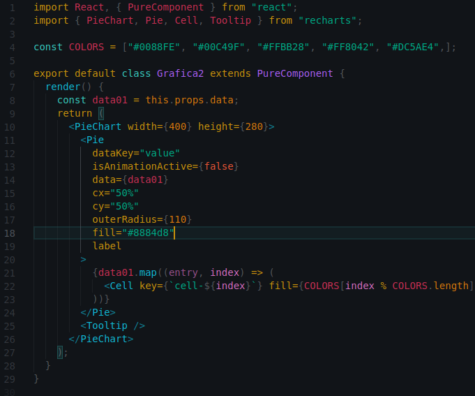

### Grafica3.js
Este componente es un gráfico de barras que muestra información relacionada con la votación en diferentes sedes. Utiliza la biblioteca Recharts de React para construir el gráfico.

En la parte superior del archivo, se importan los componentes necesarios de la biblioteca Recharts.

Luego, se define el componente Grafica3 como una clase que extiende PureComponent de React. El método render() retorna el componente BarChart que muestra el gráfico de barras. Los datos para el gráfico son proporcionados a través de la propiedad data, que se pasa como una prop al componente.

Dentro del componente BarChart, se definen los componentes XAxis, YAxis, CartesianGrid, Tooltip y Legend, que son los elementos que se muestran en el gráfico.

La propiedad dataKey del componente XAxis se establece en "sede", lo que indica que los datos de las barras se mostrarán en función del valor de la propiedad "sede" en los datos.

La propiedad dataKey del componente Bar se establece en "votos", lo que indica que los valores de las barras se tomarán de la propiedad "votos" en los datos.

Finalmente, se exporta el componente Grafica3 como el valor por defecto del archivo.

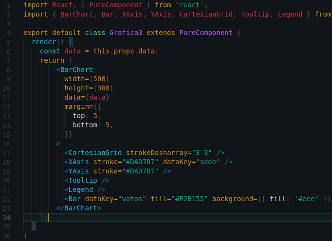

### Grafica4.js
Este es un componente de gráfico circular (pie chart) hecho con la librería "recharts" de React.

El componente "Grafica4" muestra un gráfico circular donde cada porción del círculo representa un valor numérico. Al pasar el mouse sobre una porción, se activa una animación que resalta la porción y muestra información adicional.

El componente define una función llamada "renderActiveShape" que crea la animación de resaltado al pasar el mouse sobre una porción del círculo. Esta función utiliza la información de la porción activa para mostrar un label con el nombre de la porción y su valor, un sector más grande que la porción que se resalta, una línea que conecta la porción con el label, y una pequeña bola en el extremo de la línea.

El componente utiliza un array llamado "COLORS" para definir los colores de cada porción del círculo.

El componente define una función llamada "onPieEnter" que se activa cuando se pasa el mouse sobre una porción del círculo. Esta función cambia el estado del componente para activar la animación de resaltado.

El componente utiliza el componente "PieChart" de la librería "recharts" para crear el gráfico circular. El componente "PieChart" recibe una serie de props que especifican el tamaño y otras características del gráfico.

El componente utiliza el componente "Pie" de la librería "recharts" para crear las porciones del círculo. El componente "Pie" recibe una serie de props que especifican el tamaño, los datos a mostrar, el radio interior y exterior de las porciones, y otras características de cada porción.

El componente utiliza el componente "Cell" de la librería "recharts" para definir los colores de cada porción del círculo. El componente "Cell" recibe una prop "fill" que especifica el color de la porción.

En resumen, "Grafica4" es un componente de React que utiliza la librería "recharts" para crear un gráfico circular animado que muestra información adicional al pasar el mouse sobre cada porción del círculo.

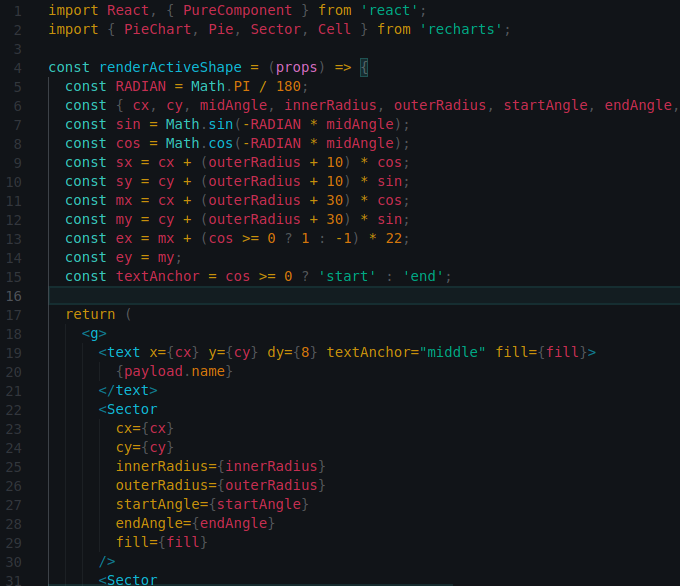

### stats.js
Este es un componente de React que muestra estadísticas de votaciones. Utiliza el hook useState y useEffect para manejar el estado de la aplicación. Importa cuatro componentes Grafica1, Grafica2, Grafica3 y Grafica4 para mostrar los datos en gráficos.

En el estado del componente, hay varios valores iniciales de estado, tales como:

* municipio: guarda el valor del municipio seleccionado.
* municipioAux: guarda el valor del municipio en el formulario.
* departamento: guarda el valor del departamento seleccionado, con un valor por defecto de "Guatemala".
* departamentoAux: guarda el valor del departamento en el formulario.
* tabla: guarda la información de las tablas.
* graph1: guarda la información de la gráfica 1.
* graph2: guarda la información de la gráfica 2.
* graph3: guarda la información de la gráfica 3.
* graph4: guarda la información de la gráfica 4.

También hay una variable llamada ip, que guarda la dirección IP local del servidor que se utilizará para hacer peticiones.

En el useEffect, se realiza una petición a una dirección url usando fetch para obtener la información necesaria para mostrar las estadísticas. Se realiza una petición cada 1 segundo mediante setInterval. También se maneja el scroll del usuario, de manera que cuando se refresca la página, la posición del scroll se guarda y se restaura después del refresco.

El componente tiene un formulario para seleccionar el municipio y el departamento. Al enviar el formulario, se actualizan los valores de municipio y departamento en el estado. Los datos de las estadísticas se muestran en dos secciones, cada una con dos gráficas y un título que describe los datos que se están mostrando. Además, hay una tabla que muestra la información de la base de datos.

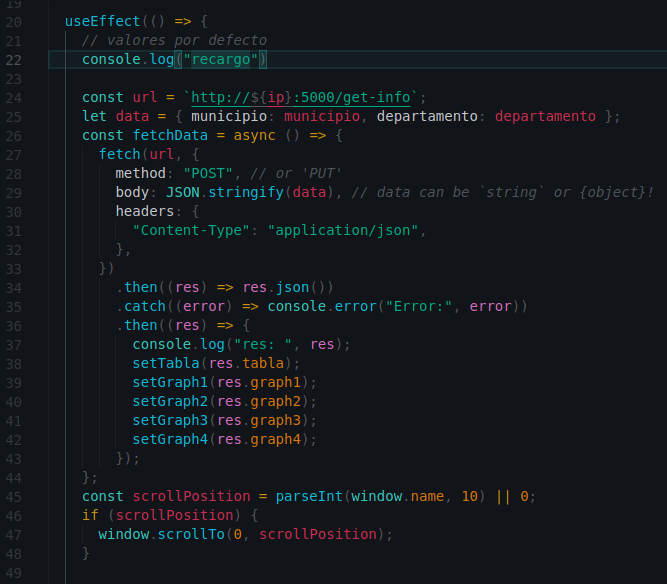

## Dockerfile
Este es un archivo Dockerfile utilizado para construir una imagen de Docker que ejecuta una aplicación de Node.js.

* La primera línea especifica la imagen base que se utilizará para construir la imagen actual. En este caso, la imagen base es "node:18", lo que significa que la versión 18 de Node.js se utilizará como base.

* La segunda línea establece el directorio de trabajo para la aplicación. Todos los comandos que se ejecuten a continuación se realizarán en este directorio.

* Las líneas 4 y 5 copian los archivos package.json y package-lock.json al directorio de trabajo. Estos archivos se utilizan para instalar las dependencias de la aplicación.

* La línea 7 ejecuta el comando "npm install" para instalar las dependencias de la aplicación.

* La línea 9 copia todos los archivos en el directorio actual al directorio de trabajo en la imagen de Docker.

* La línea 12 expone el puerto 3000 de la imagen de Docker. Este puerto puede ser utilizado por otros contenedores o por el host.

* La última línea especifica el comando que se debe ejecutar cuando se inicie un contenedor a partir de la imagen de Docker. En este caso, el comando es "npm start", lo que significa que la aplicación se iniciará cuando se ejecute un contenedor a partir de la imagen de Docker.

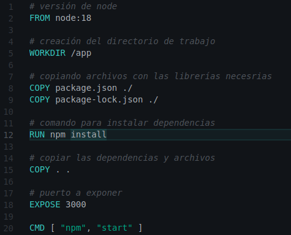

# KUBERNETES (K8S)
## api.yaml
Este archivo YAML define un servicio de Kubernetes llamado "api-svc" y un deployment llamado "api" para ejecutar una aplicación en un clúster de Kubernetes.

El servicio "api-svc" especifica que debe ser un tipo LoadBalancer y redirige el tráfico entrante en el puerto 5000 a la aplicación que se ejecuta en el puerto 5000 en el pod que tenga la etiqueta "app: api".

El deployment "api" define un replicaset de un pod que ejecuta la imagen "gerson7w7/api_proyecto1" en un contenedor llamado "api". El pod es seleccionado por la etiqueta "app: api". Se especifican límites de recursos para el contenedor y el puerto 5000 está expuesto para el tráfico entrante.

En resumen, este archivo YAML define una aplicación llamada "api" que se ejecuta en un clúster de Kubernetes, que está disponible en un servicio llamado "api-svc".

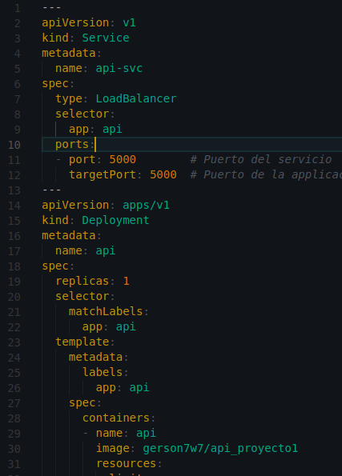

## grpc-client.yaml
Este archivo YAML define un servicio Kubernetes de tipo LoadBalancer y un deployment para un cliente gRPC.

El servicio se define primero y se le da el nombre grpc-client-svc. Este servicio tiene un selector app: grpc-client que busca los pods con la etiqueta app: grpc-client. El servicio expone el puerto 4000 en el clúster y lo asigna al puerto 4000 del pod.

A continuación, el archivo YAML define un deployment llamado grpc-client con un pod replica de 1. El selector en la sección spec.selector.matchLabels busca los pods que tienen la etiqueta app: grpc-client para el despliegue. La plantilla de pod en la sección spec.template también usa la misma etiqueta. La plantilla de pod contiene un solo contenedor llamado grpc-client con la imagen Docker gerson7w7/grpc-client_proyecto1. Además, el recurso límite de memoria se establece en 2 GB y el límite de CPU en 100 milicore.

Por último, se expone el puerto 4000 en el contenedor para que pueda ser utilizado por el servicio definido previamente.

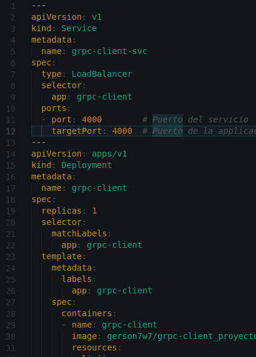

## grpc-server.yaml
Este YAML define un servicio y un deployment en Kubernetes para un servidor gRPC. Aquí está la descripción detallada:

El primer objeto es un servicio, que se encarga de exponer el servidor al mundo exterior. El servicio se llama grpc-server-svc y está definido como un servicio de tipo ClusterIP, lo que significa que solo es accesible dentro del clúster de Kubernetes. El selector especifica que el servicio está dirigido a pods con la etiqueta app: grpc-server. El puerto del servicio es 50051 y está mapeado al puerto 50051 del pod.

El segundo objeto es un deployment, que se encarga de desplegar los pods que contienen la aplicación. El deployment se llama grpc-server y especifica que debe haber una réplica de la aplicación corriendo en el clúster. El selector especifica que el deployment está dirigido a pods con la etiqueta app: grpc-server. La plantilla del pod contiene un contenedor llamado grpc-server, que utiliza la imagen gerson7w7/grpc-server_proyecto1. Los recursos del contenedor están limitados a 2 gigabytes de memoria y 100 milicpus. El contenedor expone el puerto 50051, que es el puerto en el que el servidor gRPC está escuchando.

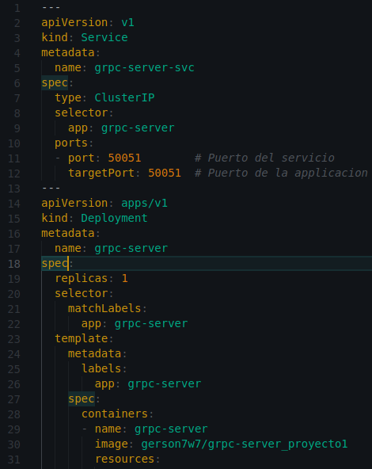

## ingress.yaml
Este archivo YAML define un objeto Ingress en Kubernetes que se llama "balanceador".

El Ingress define las reglas para enrutar el tráfico entrante a diferentes servicios en función de la URL o el host.

El objeto Ingress especifica que se utilizará la clase de controlador de ingreso llamada "nginx" para manejar las solicitudes entrantes.

La sección "rules" define las reglas para enrutar el tráfico en función del host y la ruta.

Para este caso, se tiene una sola regla que especifica dos rutas diferentes:

* La primera ruta se utiliza para enrutar el tráfico a un servicio llamado "grpc-client-svc" en el puerto 4000. Este servicio se utiliza para el cliente gRPC en el archivo YAML anterior.
* La segunda ruta se utiliza para enrutar el tráfico a un servicio llamado "redis-pub-svc" en el puerto 4100. Este servicio se utiliza para la publicación de mensajes en Redis.

En ambas rutas se especifica "path: /add-voto" y "pathType: Prefix" para que todas las solicitudes que comienzan con la ruta especificada sean enrutadas a los servicios correspondientes.

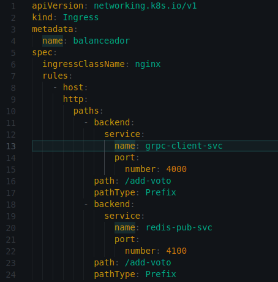

## mysql.yaml
Este YAML define un servicio, un volumen persistente y un deployment para una base de datos MySQL en Kubernetes.

En primer lugar, el servicio database-svc se define como tipo ClusterIP, lo que significa que solo se puede acceder al servicio desde dentro del cluster de Kubernetes. El servicio está etiquetado con app: database y tiene un puerto especificado en el puerto 3306.

A continuación, se define un volumen persistente para la base de datos, con nombre mysql-pv-claim, que tiene una solicitud de almacenamiento de 10Gi. El volumen tiene un modo de acceso ReadWriteOnce, lo que significa que solo puede ser montado por un solo nodo a la vez para lectura y escritura.

Por último, se define el deployment para desplegar los pods de la base de datos. El deployment se llama database y tiene una réplica. También está etiquetado con app: database para que coincida con el selector del servicio y del volumen persistente. El contenedor del pod se llama database y se basa en la imagen gerson7w7/mysql_proyecto1. Se especifican los recursos que puede usar el contenedor, con límites máximos de 2GiB de memoria y 500 milisegundos de tiempo de CPU. También se especifica el puerto 3306 para el contenedor y se monta el volumen persistente en la ruta /var/lib/mysql.

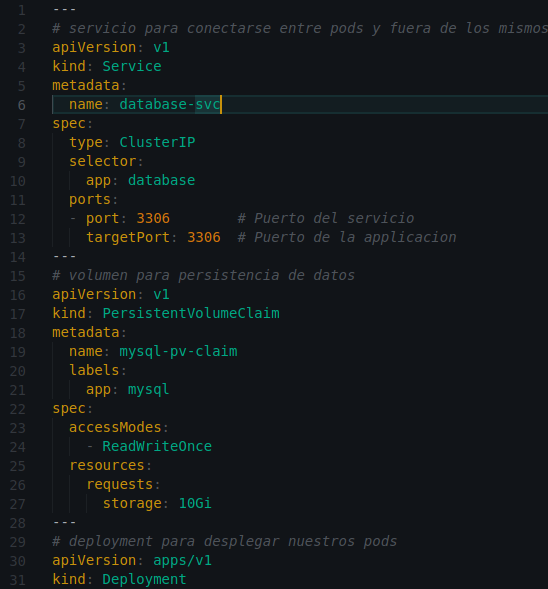

## pub-redis.yaml
Este archivo YAML describe un servicio y un deployment de Kubernetes para un servidor de Redis en modo publicador.

El servicio se define con el nombre pub-redis-svc y se especifica que es de tipo LoadBalancer, lo que permite exponer el servicio en una dirección IP pública. El selector app: pub-redis-server indica que el servicio enruta el tráfico hacia los pods que tienen la etiqueta app: pub-redis-server. El servicio escucha en el puerto 4100 y redirige el tráfico al puerto 4100 de los pods correspondientes.

El deployment se define con el nombre pub-redis y se especifica que se deben tener 1 réplica del pod. El selector matchLabels: app: pub-redis indica que este deployment maneja los pods con la etiqueta app: pub-redis. La sección template especifica cómo se configuran los pods. Se define un contenedor llamado pub-redis que utiliza la imagen gerson7w7/pub-redis_proyecto1. También se especifica un límite de recursos para el contenedor, con una asignación máxima de 2 GB de memoria y 100 milicores de CPU. El contenedor escucha en el puerto 4100, que es el puerto que el servicio está configurado para enrutar.

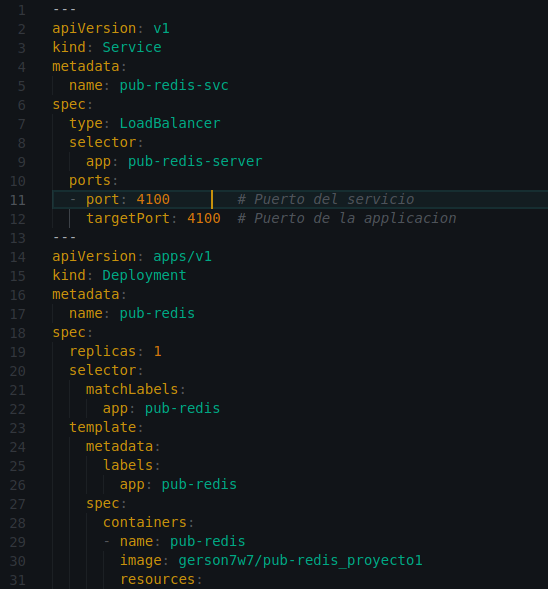

## sub-redis.yaml
Este YAML describe un Deployment para desplegar un contenedor de un servicio de Redis que actúa como suscriptor.

* apiVersion: apps/v1 indica que se está utilizando la API de aplicaciones de Kubernetes en la versión 1.
* kind: Deployment especifica que se trata de un Deployment.
metadata contiene metadatos adicionales para el objeto, como el nombre del Deployment.
* name: sub-redis especifica el nombre del Deployment.
* spec describe el estado deseado del Deployment.
* replicas: 1 especifica que se desea una réplica del contenedor.
* selector especifica cómo el Deployment selecciona los Pods en su conjunto.
* matchLabels indica que los Pods que se emparejen con el label app: sub-redis se incluirán en el Deployment.
* template describe el conjunto de contenedores que se ejecutan en cada Pod que el Deployment crea.
* metadata contiene metadatos adicionales para el objeto, como el label app: sub-redis.
* labels asigna el label app: sub-redis al Pod.
* spec describe el comportamiento del contenedor en el Pod.
* containers es una lista de los contenedores que se ejecutan en el Pod.
* name especifica el nombre del contenedor.
* image especifica la imagen Docker utilizada para crear el contenedor.
* resources limita los recursos que puede usar el contenedor.
* ports define los puertos del contenedor que se exponen a través del Pod. En este caso, solo se expone el puerto 6379 por defecto.

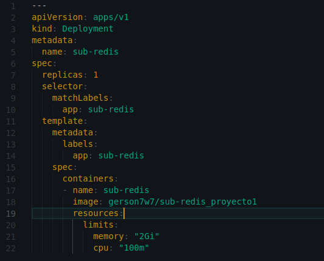

## redis.yaml
* Este YAML define un servicio de Kubernetes llamado redis-svc que permite la comunicación entre pods y fuera de los mismos.

* El servicio utiliza el tipo ClusterIP, que permite acceder al servicio desde dentro del cluster, pero no desde fuera de él.

* El selector app: redis se utiliza para indicar a qué pods se va a dirigir el servicio. Solo los pods que tengan el label app: redis se podrán comunicar a través de este servicio.

* El puerto 6379 es el puerto que se va a exponer para el servicio, y targetPort se utiliza para indicar el puerto en el que la aplicación está escuchando.

* Este YAML define un deployment de Kubernetes llamado redis que se encargará de crear y administrar los pods.

* El deployment asegura que siempre haya una réplica del pod corriendo en el cluster, gracias a la propiedad replicas: 1.

* El selector matchLabels: app: redis se utiliza para asociar el deployment con los pods que tengan el label app: redis.

* La sección template: especifica cómo se deben crear los pods. En este caso, se indica que los pods deben tener el label app: redis.

* La sección containers: define los contenedores que se ejecutarán en cada pod. En este caso, solo hay un contenedor llamado redis.

* La propiedad image: gerson7w7/redis_proyecto1 indica la imagen de Docker que se va a utilizar para crear los contenedores.

* La propiedad resources: se utiliza para definir los límites de recursos que se van a asignar a los contenedores. En este caso, se asigna un límite de 2Gi de memoria RAM y 500m de CPU.

* La propiedad ports: se utiliza para indicar los puertos que se van a exponer en el contenedor. En este caso, se expone el puerto 6379, que es el mismo que se especificó en el servicio.

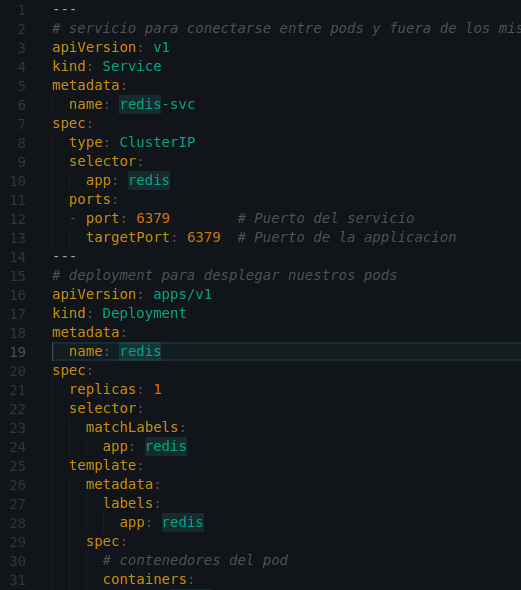